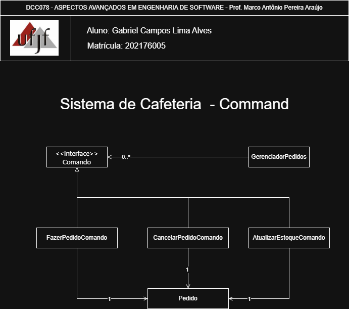
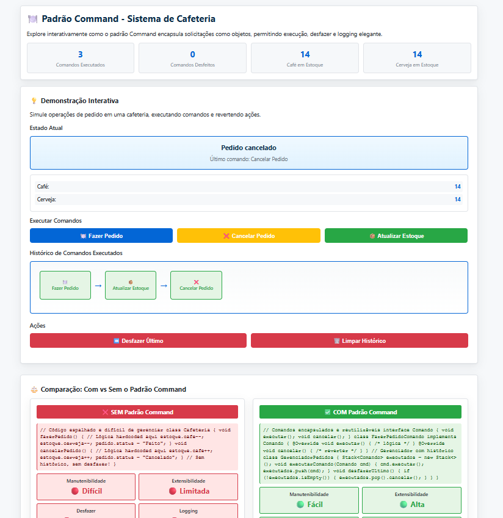

# Command — Sistema de Cafeteria

<p align="center">
	<a href="https://www.ufjf.br/" rel="noopener">
		
	</a>
</p>

<h3 align="center">DCC078-2025.3-A — Aspectos Avançados em Engenharia de Software (UFJF/ICE)</h3>

---

## 📝 Sumário
- [Sobre](#sobre)
- [Diagrama de Classe](#diagrama)
- [Funcionalidades](#funcionalidades)
- [Interface de Demonstração](#interface)
- [Tecnologias](#tecnologias)
- [Exemplo de Uso](#exemplo)
- [Como Executar e Testes](#testes)
- [Autor](#autor)

## 🧐 Sobre <a name="sobre"></a>
> **Disciplina:** DCC078 – Aspectos Avançados em Engenharia de Software   </br>
> **Projeto:** Demonstração do padrão Command em um sistema de cafeteria   </br>
> **Docente:** Prof. Marco Antônio Pereira Araújo  </br>
> **Data de entrega:** 01/12/2025   </br>
> **Aluno:** [Gabriel Campos Lima Alves](#autor)  </br>

### Padrão Command
Implementação do padrão **Command** aplicada a um sistema realista de pedidos em cafeteria. O foco é encapsular solicitações como objetos, permitindo execução, cancelamento e histórico de operações. Demonstra:
- Uma interface Comando que declara executar() e cancelar()
- Comandos concretos (FazerPedidoComando, CancelarPedidoComando, AtualizarEstoqueComando)
- GerenciadorPedidos como Invoker que mantém histórico em Stack
- Receivers (Pedido e Estoque) que executam as operações reais
- Interface interativa com visualização em tempo real das execuções e cancelamentos
- Validação visual de encapsulamento e independência de operações

## 📐 Diagrama de Classe <a name="diagrama"></a>
O diagrama abaixo representa a arquitetura do projeto, enfatizando o padrão **Command** como mecanismo de encapsulamento de operações:
<p align="center">
  
</p>

## 🚀 Funcionalidades <a name="funcionalidades"></a>
### Sistema de Pedidos em Cafeteria
- **Comando**: Interface que define executar() e cancelar()
- **FazerPedidoComando**: Comando concreto para fazer pedidos, decrementando estoque
- **CancelarPedidoComando**: Comando para cancelar pedidos
- **AtualizarEstoqueComando**: Comando para atualizar quantidades de café e cerveja
- **GerenciadorPedidos**: Invoker que executa comandos e mantém histórico para desfazer
- **Pedido**: Receiver que gerencia estado do pedido
- **Estoque**: Receiver que gerencia quantidades de itens
- **GerenciadorPedidosTest**: Suite completa de testes validando o padrão

### Recursos
- ✅ Implementação completa do padrão Command
- ✅ Encapsulamento de operações como objetos
- ✅ Histórico de comandos com Stack para desfazer
- ✅ Separação entre invocação e execução
- ✅ Comandos independentes e reutilizáveis
- ✅ Cálculo automático de mudanças em estoque
- ✅ Rastreamento de estados de pedidos
- ✅ 4 testes unitários com cobertura completa
- ✅ Interface web interativa com animações e visualizações


Também há uma interface web de demonstração interativa incluída: [Interface de Demonstração](https://camposcodes.github.io/PadroesComportamentais-Command/)


<p align="center">
	
</p>

### Funcionalidades da Interface
- **Estado Atual**: Visualização do pedido e estoque em tempo real
- **Execução Interativa de Comandos**: Botões para fazer pedido, cancelar e atualizar estoque
- **Histórico de Comandos**: Timeline mostrando comandos executados
- **Desfazer**: Possibilidade de reverter o último comando
- **Comparação Visual**: Lado-a-lado mostrando diferenças entre abordagem com e sem Command
- **Métricas em Tempo Real**: Exibição de comandos executados, desfeitos e níveis de estoque
- **Vantagens do Padrão**: Grid com 6 vantagens-chave explicadas
- **Como Funciona**: Seção educativa com conceitos técnicos e fluxo do padrão

##  Tecnologias <a name="tecnologias"></a>
- **Java 11+**
- **JUnit 5** - Framework de testes
- **Maven** - Gerenciamento de dependências
- **HTML5/CSS3/JavaScript** - Interface web
- **Git** - Controle de versão

## 📊 Exemplo de Uso <a name="exemplo"></a>
```java
// Criando receivers
Pedido pedido = new Pedido();
Estoque estoque = new Estoque(10, 10);

// Criando comandos
Comando fazerPedido = new FazerPedidoComando(pedido, estoque);
Comando cancelarPedido = new CancelarPedidoComando(pedido, estoque);
Comando atualizarEstoque = new AtualizarEstoqueComando(estoque, 15, 15);

// Invoker
GerenciadorPedidos gerenciador = new GerenciadorPedidos();

System.out.println("📋 ESTADO INICIAL: " + pedido.getSituacao());
System.out.println("📦 Estoque: Café=" + estoque.getQuantidadeCafe() + ", Cerveja=" + estoque.getQuantidadeCerveja());

// Executando fazer pedido
gerenciador.executarComando(fazerPedido);
System.out.println("🍽️ APÓS FAZER PEDIDO: " + pedido.getSituacao());
System.out.println("📦 Estoque: Café=" + estoque.getQuantidadeCafe() + ", Cerveja=" + estoque.getQuantidadeCerveja());

// Executando cancelar pedido
gerenciador.executarComando(cancelarPedido);
System.out.println("❌ APÓS CANCELAR PEDIDO: " + pedido.getSituacao());

// Desfazendo último comando (volta ao estado de pedido feito)
gerenciador.cancelarUltimoComando();
System.out.println("⏮️ APÓS DESFAZER: " + pedido.getSituacao());
```

**Saída esperada:**
```
📋 ESTADO INICIAL: Pendente
📦 Estoque: Café=10, Cerveja=10
🍽️ APÓS FAZER PEDIDO: Pedido feito
📦 Estoque: Café=9, Cerveja=9
❌ APÓS CANCELAR PEDIDO: Pedido cancelado
⏮️ APÓS DESFAZER: Pedido feito
```

## 🧪 Como Executar e Testes <a name="testes"></a>
### Pré-requisitos
- Java 11 ou superior
- Maven 3.6+

### Comandos
```bash
# Compilar o projeto
mvn clean compile

# Executar todos os testes
mvn test

# Executar teste específico
mvn test -Dtest=GerenciadorPedidosTest

# Empacotar
mvn package
```

### Testes Inclusos
- **GerenciadorPedidosTest**: 4 testes unitários completos
  - deveFazerPedido - Validação de execução de fazer pedido
  - deveCancelarPedido - Verificação de cancelamento de pedido
  - deveAtualizarEstoque - Validação de atualização de estoque
  - deveCancelarUltimoComando - Teste de desfazer último comando

**Total: 4 testes** garantindo cobertura completa do padrão Command

### Interface Web de Demonstração
1. Abra o arquivo `command-demo.html` em um navegador web
2. Visualize o estado atual do pedido e estoque
3. Explore a execução de comandos com:
   - Botões para fazer pedido, cancelar e atualizar estoque
   - Timeline mostrando histórico de comandos executados
   - Possibilidade de desfazer o último comando
   - Comparação visual com/sem padrão Command
   - Explicação visual do padrão Command

## 👨‍💻 Autor <a name="autor"></a>
**Gabriel Campos Lima Alves**
Matrícula: 202176005
Email: campos.gabriel@estudante.ufjf.br
GitHub: [@CamposCodes](https://github.com/CamposCodes)

---

*Projeto de uso acadêmico exclusivo para a disciplina DCC078 - UFJF*
